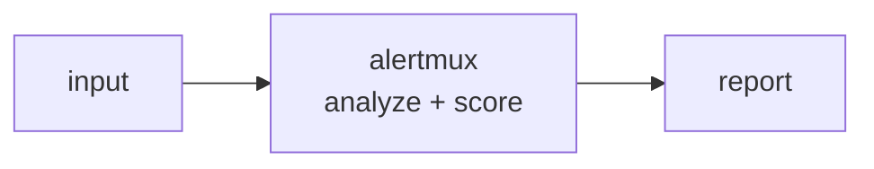

<a name="top"></a>
<div align="center">


# ALERTMUX

### Alert dedup, correlation, and routing in front of Grafana / PagerDuty


[](https://pypi.org/project/cognis-alertmux/) [](https://github.com/cognis-digital/alertmux/actions) [](LICENSE) [](https://github.com/cognis-digital)

*DevOps & Observability — status, synthetics, alerts, and cloud cost.*

</div>

```bash
pip install cognis-alertmux
alertmux mux alerts.json   # → noisy alert storm collapsed into a few incidents
```

## Usage — step by step

`alertmux` is AIOps-lite alert handling: it dedups, correlates, and routes raw alerts into incidents.

1. **Install** (Python 3.10+):
   ```bash
   pip install -e .            # or: pipx install alertmux
   ```
2. **Run the full pipeline** (dedup + correlate + route) over a raw alert file:
   ```bash
   alertmux mux demos/01-basic/alerts.json
   ```
3. **Use custom routing rules** and a correlation window:
   ```bash
   alertmux mux alerts.json --rules rules.json --format json
   alertmux rules --rules rules.json          # print the active rules
   ```
4. **View the noise-reduction (dedup) buckets only**, including from stdin:
   ```bash
   cat alerts.json | alertmux dedup -
   ```
5. **Read the output** in CI / a pipeline — the JSON `summary` reports `incidents`, `paging`, and `noise_reduction_pct`:
   ```bash
   alertmux mux alerts.json --format json | jq '.summary.noise_reduction_pct'
   ```


## Contents

- [Why alertmux?](#why) · [Features](#features) · [Quick start](#quick-start) · [Example](#example) · [Architecture](#architecture) · [AI stack](#ai-stack) · [How it compares](#how-it-compares) · [Integrations](#integrations) · [Install anywhere](#install-anywhere) · [Related](#related) · [Contributing](#contributing)

<a name="why"></a>
## Why alertmux?

AIOps-lite

`alertmux` is single-purpose, scriptable, and self-hostable: point it at a target, get prioritized results in the format your workflow already speaks (table · JSON · SARIF), gate CI on it, and let agents drive it over MCP.

<div align="right"><a href="#top">↑ back to top</a></div>

<a name="features"></a>
## Features

- ✅ **Dedup** repeated/flapping alerts by fingerprint (alertname + identity labels)
- ✅ **Correlate** alerts into incidents by service/host within a time window
- ✅ **Route** incidents to receivers with ordered, severity-gated rules
- ✅ Normalizes mixed severity vocabularies (`sev1`/`crit`/`page`/`warn`/`notice`)
- ✅ Output as **table · JSON · SARIF 2.1.0** (for GitHub code-scanning / CI)
- ✅ Reads Alertmanager-webhook, bare-list, or single-alert JSON (file or stdin)
- ✅ 9 real-use-case demos in [`demos/`](demos/) — each with a `SCENARIO.md`
- ✅ Runs on Linux/macOS/Windows · Docker · devcontainer
- ✅ Ports in Python, JavaScript, Go, and Rust (`ports/`)

<div align="right"><a href="#top">↑ back to top</a></div>

<a name="quick-start"></a>
## Quick start

```bash
pip install cognis-alertmux
alertmux --version
alertmux mux demos/01-basic/alerts.json            # dedup + correlate + route
alertmux mux demos/01-basic/alerts.json --format json   # machine-readable
alertmux mux demos/06-sarif-ci/alerts.json --format sarif > alertmux.sarif  # CI / code-scanning
alertmux dedup demos/03-flapping-resolved/alerts.json   # noise-reduction view only
alertmux rules                                     # print the active routing rules
```

`--format` works **before or after** the subcommand.

<div align="right"><a href="#top">↑ back to top</a></div>

<a name="example"></a>
## Example

```text
$ alertmux mux demos/01-basic/alerts.json
events=12  alerts=5  incidents=2  paging=1  noise_reduction=83.3%
------------------------------------------------------------------------------------
INCIDENT   SEV      STAT     EVTS RECEIVER       PAGE  KEY
------------------------------------------------------------------------------------
INC-39866  critical firing     10 pagerduty      YES  service=payments
           names=HighErrorRate,LatencySLOburn,PgPoolSaturated,PostgresDown
INC-71177  warning  firing      2 slack-noise    no   service=checkout
           names=HighErrorRate
```

*(`INC-…` ids are content-derived and will differ between runs.)*

A 12-message pager storm becomes **2 incidents and 1 page**.

### Demos — 9 real-use-case scenarios

Each [`demos/<NN-name>/`](demos/) folder has a real input file and a `SCENARIO.md`
explaining where the data came from, what to expect, the exact run command, and
how to act:

| Demo | Shows |
|---|---|
| [`01-basic`](demos/01-basic/) | A Postgres cascade: 12 events → 2 incidents → 1 page |
| [`02-k8s-node-pressure`](demos/02-k8s-node-pressure/) | One bad EKS node fans out into 5 alerts, all `kube-prometheus-stack` labels |
| [`03-flapping-resolved`](demos/03-flapping-resolved/) | A flapping target (4× fire/resolve) that should **never** page |
| [`04-team-routing`](demos/04-team-routing/) | Custom `--rules` routing by owning team (DBA pages, others Slack) |
| [`05-window-split`](demos/05-window-split/) | Same service, two outages 11h apart → two incidents (`--window`) |
| [`06-sarif-ci`](demos/06-sarif-ci/) | Export incidents as **SARIF 2.1.0** for GitHub code-scanning |
| [`07-severity-aliases`](demos/07-severity-aliases/) | Mixed severity vocabularies (`sev1`/`crit`/`warn`) normalized |
| [`08-stdin-pipeline`](demos/08-stdin-pipeline/) | Stream alerts from stdin and gate a pipeline with `jq` |
| [`09-multiservice-storm`](demos/09-multiservice-storm/) | A DNS root-cause storm: 32 events → 5 incidents (84% noise cut) |

### SARIF 2.1.0 export

`--format sarif` renders incidents as a [SARIF 2.1.0](https://sarifweb.azurewebsites.net/)
log — one `result` per incident, one reporting-descriptor `rule` per alertname,
severity mapped to SARIF `level` + `security-severity`, and a stable
`partialFingerprints.alertmuxIncidentId` so re-runs deduplicate in the UI:

```yaml
- run: alertmux mux alerts.json --format sarif > alertmux.sarif
- uses: github/codeql-action/upload-sarif@v3
  with:
    sarif_file: alertmux.sarif
```

<div align="right"><a href="#top">↑ back to top</a></div>

<a name="architecture"></a>
## Architecture



<div align="right"><a href="#top">↑ back to top</a></div>

<a name="ai-stack"></a>
## Use it from any AI stack

`alertmux` is interoperable with every popular way of using AI:

- **MCP server** — `alertmux mcp` (Claude Desktop, Cursor, Cognis.Studio, [uncensored-fleet](https://github.com/cognis-digital/uncensored-fleet))
- **OpenAI-compatible / JSON** — pipe `alertmux scan . --format json` into any agent or LLM
- **LangChain · CrewAI · AutoGen · LlamaIndex** — wrap the CLI/JSON as a tool in one line
- **CI / scripts** — exit codes + SARIF for non-AI pipelines

<div align="right"><a href="#top">↑ back to top</a></div>

<a name="how-it-compares"></a>
## How it compares

| | **Cognis alertmux** | Keep |
|---|:---:|:---:|
| Self-hostable, no account | ✅ | varies |
| Single command, zero config | ✅ | ⚠️ |
| JSON + SARIF for CI | ✅ | varies |
| MCP-native (AI agents) | ✅ | ❌ |
| Polyglot ports (JS/Go/Rust) | ✅ | ❌ |
| Open license | ✅ COCL | varies |

*Built in the spirit of **Keep**, re-framed the Cognis way. Missing a credit? Open a PR.*

<div align="right"><a href="#top">↑ back to top</a></div>

<a name="integrations"></a>
## Integrations

Pipes into your stack: **SARIF** for code-scanning, **JSON** for anything, an **MCP server** (`alertmux mcp`) for AI agents, and a webhook forwarder for SIEM/Slack/Jira. See [`docs/INTEGRATIONS.md`](docs/INTEGRATIONS.md).

<div align="right"><a href="#top">↑ back to top</a></div>

<a name="install-anywhere"></a>
## Install — every way, every platform

```bash
pip install "git+https://github.com/cognis-digital/alertmux.git"    # pip (works today)
pipx install "git+https://github.com/cognis-digital/alertmux.git"   # isolated CLI
uv tool install "git+https://github.com/cognis-digital/alertmux.git" # uv
pip install cognis-alertmux                                          # PyPI (when published)
docker run --rm ghcr.io/cognis-digital/alertmux:latest --help        # Docker
brew install cognis-digital/tap/alertmux                             # Homebrew tap
curl -fsSL https://raw.githubusercontent.com/cognis-digital/alertmux/main/install.sh | sh
```

| Linux | macOS | Windows | Docker | Cloud |
|---|---|---|---|---|
| `scripts/setup-linux.sh` | `scripts/setup-macos.sh` | `scripts/setup-windows.ps1` | `docker run ghcr.io/cognis-digital/alertmux` | [DEPLOY.md](docs/DEPLOY.md) (AWS/Azure/GCP/k8s) |

<div align="right"><a href="#top">↑ back to top</a></div>

<a name="related"></a>
## Related Cognis tools

- [`statuskit`](https://github.com/cognis-digital/statuskit) — Self-hosted status page with incident timeline and subscribers
- [`probesite`](https://github.com/cognis-digital/probesite) — Synthetic uptime and Playwright checks exported to Prometheus
- [`cloudbill`](https://github.com/cognis-digital/cloudbill) — Multi-cloud cost report, anomaly detection, and FOCUS export
- [`k8scost`](https://github.com/cognis-digital/k8scost) — Kubernetes cost and rightsizing advisor with no Prometheus dependency
- [`otelbox`](https://github.com/cognis-digital/otelbox) — One-command OpenTelemetry collector + dashboards bundle

**Explore the suite →** [🗂️ all 170+ tools](https://github.com/cognis-digital/cognis-neural-suite) · [⭐ awesome-cognis](https://github.com/cognis-digital/awesome-cognis) · [🔗 cognis-sources](https://github.com/cognis-digital/cognis-sources) · [🤖 uncensored-fleet](https://github.com/cognis-digital/uncensored-fleet) · [🧠 engram](https://github.com/cognis-digital/engram)

<div align="right"><a href="#top">↑ back to top</a></div>

<a name="contributing"></a>
## Contributing

PRs, new rules, and demo scenarios are welcome under the collaboration-pull model — see [CONTRIBUTING.md](CONTRIBUTING.md) and [SECURITY.md](SECURITY.md).

> ### ⭐ If `alertmux` saved you time, **star it** — it genuinely helps others find it.

## Interoperability

`{}` composes with the 300+ tool Cognis suite — JSON in/out and a shared
OpenAI-compatible `/v1` backbone. See **[INTEROP.md](INTEROP.md)** for the
suite map, composition patterns, and reference stacks.

## License

Source-available under the **Cognis Open Collaboration License (COCL) v1.0** — free for personal, internal-evaluation, research, and educational use; **commercial / production use requires a license** (licensing@cognis.digital). See [LICENSE](LICENSE).

---

<div align="center"><sub><b><a href="https://cognis.digital">Cognis Digital</a></b> · one of 170+ tools in the <a href="https://github.com/cognis-digital/cognis-neural-suite">Cognis Neural Suite</a> · <i>Making Tomorrow Better Today</i></sub></div>
